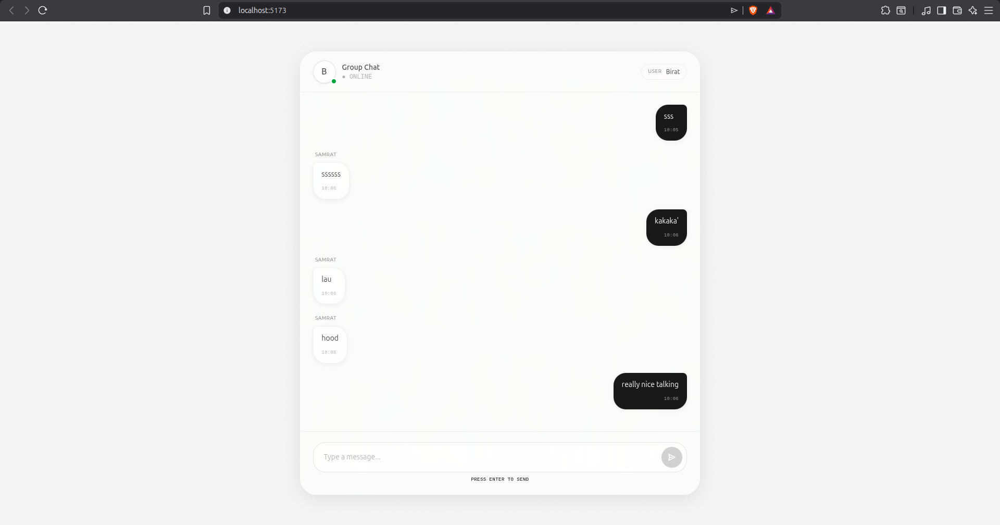
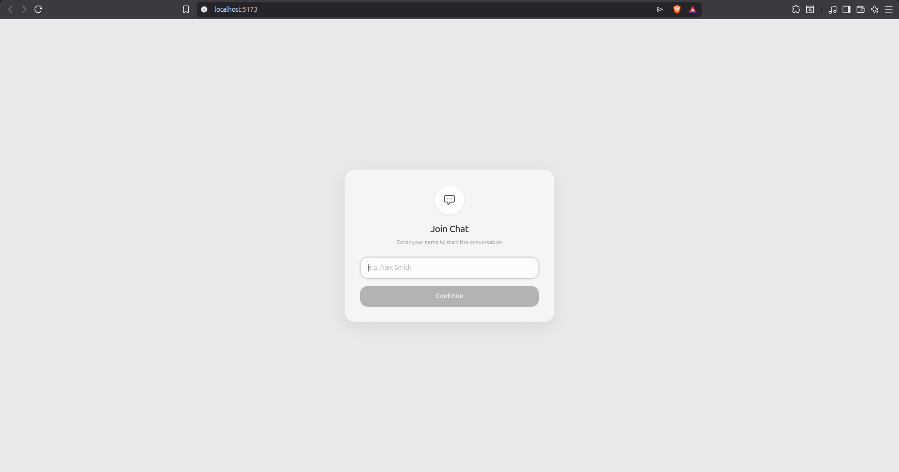
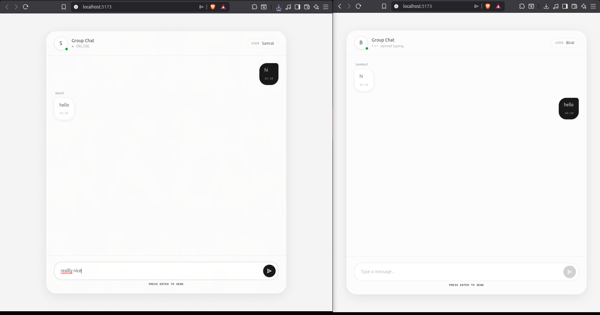

# Hush - Real-Time Chat Application

A modern, minimalist real-time chat application built with React, Socket.IO, and a beautiful frosted-glass UI inspired by Nothing OS design language.





## ✨ Features

- **Real-time messaging** - Instant message delivery using WebSocket
- **Typing indicators** - See when other users are typing
- **User presence** - Know when users join the chat room
- **Frosted glass UI** - Beautiful glassmorphism design with noise texture
- **Monochrome aesthetic** - Calm, minimal, premium look
- **Responsive design** - Works seamlessly on mobile and desktop
- **Smooth animations** - Fade-in effects for messages and interactions
- **Custom scrollbar** - Sleek, minimalist scrollbar styling
- **Enter to send** - Quick message sending with keyboard shortcut

## 🛠️ Tech Stack

### Frontend

- **React 19** - Modern React with hooks
- **Vite** - Lightning-fast build tool (using Rolldown)
- **Socket.IO Client** - WebSocket client for real-time communication
- **Tailwind CSS v4** - Utility-first CSS framework
- **Custom CSS** - Glassmorphism effects and animations

### Backend

- **Node.js** - JavaScript runtime
- **Express 5** - Web framework
- **Socket.IO** - WebSocket server for real-time events
- **HTTP Server** - Built-in Node.js HTTP server

## 📁 Project Structure

```
websocket/
├── backend/
│   ├── server.js          # Socket.IO server
│   ├── package.json       # Backend dependencies
│   └── .gitignore
├── frontend/
│   ├── src/
│   │   ├── App.jsx        # Main chat component
│   │   ├── ws..js         # WebSocket connection manager
│   │   ├── main.jsx       # React entry point
│   │   └── index.css      # Global styles & glassmorphism
│   ├── public/
│   │   ├── pic11.png      # Login screen
│   │   ├── pic12.png      # Chat interface
│   │   └── pic13.png      # Active conversation
│   ├── package.json       # Frontend dependencies
│   ├── vite.config.js     # Vite configuration
│   └── index.html
└── README.md
```

## 🚀 Getting Started

### Prerequisites

- Node.js (v18 or higher)
- npm or yarn

### Installation

1. **Clone the repository**

```bash
git clone https://github.com/ksamrat224/chat.git
cd chat
```

2. **Install backend dependencies**

```bash
cd backend
npm install
```

3. **Install frontend dependencies**

```bash
cd ../frontend
npm install
```

### Running the Application

1. **Start the backend server**

```bash
cd backend
node server.js
```

Server will run on `http://localhost:4600`

2. **Start the frontend development server** (in a new terminal)

```bash
cd frontend
npm run dev
```

Frontend will run on `http://localhost:5173`

3. **Open multiple browser tabs** to test real-time messaging between users

## 🎨 Design System

### Color Palette (Monochrome)

- Background: `#f5f5f5` with subtle noise texture
- Glass surfaces: `rgba(255, 255, 255, 0.7)` with backdrop blur
- Text primary: `black/70-80`
- Text secondary: `black/30-40`
- Borders: `black/5-20` (ultra-subtle)
- Message bubbles (sender): `black/90`
- Message bubbles (receiver): Frosted glass with `white/50`

### Typography

- **Body**: System sans-serif (clean, minimal)
- **Timestamps**: JetBrains Mono (monospace, dot-matrix feel)
- **Weights**: 400-600 for calm aesthetic

### Key UI Components

#### Login Modal

- Frosted glass card with `backdrop-blur(20px)`
- Circular icon container
- Minimal border styling
- Smooth enter animation

#### Chat Interface

- **Header**: Circular avatar with online status dot, typing indicators
- **Messages**: Distinct bubble styles for sender vs receiver
- **Input**: Floating frosted glass container with circular send button
- **Scrollbar**: Custom 4px slim scrollbar

## 🔧 Key Features Explained

### WebSocket Connection Management

The app uses a singleton pattern for WebSocket connections to prevent duplicate connections:

```javascript
// ws..js
let socket = null;
export function connectWS() {
  if (!socket) {
    socket = io("http://localhost:4600");
  }
  return socket;
}
```

### Real-time Events

- `joinRoom` - User joins the chat room
- `chatMessage` - Send/receive messages
- `typing` - Broadcast typing status
- `stopTyping` - Clear typing status
- `roomNotice` - User presence notifications

### Message Flow

1. User types message and clicks Send or presses Enter
2. Message is added to local state immediately (optimistic update)
3. Message is emitted to Socket.IO server
4. Server broadcasts to all other users in the room
5. Receivers get the message and display it with fade-in animation

## 🎯 Architecture Highlights

- **Singleton WebSocket**: Prevents duplicate connections in React StrictMode
- **Named event handlers**: Proper cleanup of Socket.IO listeners
- **Optimistic updates**: Messages appear instantly for sender
- **Debounced typing**: Typing indicator stops after 1 second of inactivity
- **Room-based chat**: All users join a single "group" room

## 📱 Responsive Design

- Mobile-first approach
- User badge hidden on small screens
- Message width adapts (85% mobile, 70% desktop)
- Touch-friendly button sizing
- Fluid typography and spacing

## 🎭 Animations & Interactions

- **Fade-in**: New messages animate in from bottom (0.4s)
- **Pulsing dots**: Typing indicator with staggered animation
- **Active scale**: Buttons scale down to 0.98 on press
- **Border transitions**: Smooth focus states (200ms)
- **Backdrop blur**: Real-time frosted glass effect

## 🐛 Known Fixes

### Duplicate Message Issue (Fixed)

**Problem**: Receivers were getting messages twice.

**Cause**: Event listeners were registered inside `socket.on("connect")` callback, causing multiple registrations on reconnection.

**Solution**:

- Moved listeners outside connect callback
- Used named handler functions for proper cleanup
- Ensured `socket.off()` removes the exact listener

## 📄 License

This project is open source and available under the MIT License.

## 👤 Author

**Samrat Karki**

- GitHub: [@ksamrat224](https://github.com/ksamrat224)

## 🙏 Acknowledgments

- Design inspired by Nothing OS
- Built with modern web technologies
- Glassmorphism UI trend

---

**Built with ❤️ using React and Socket.IO**
